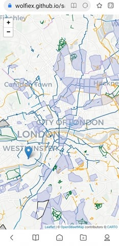
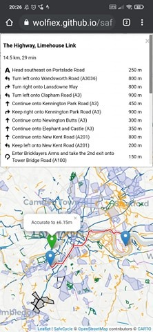
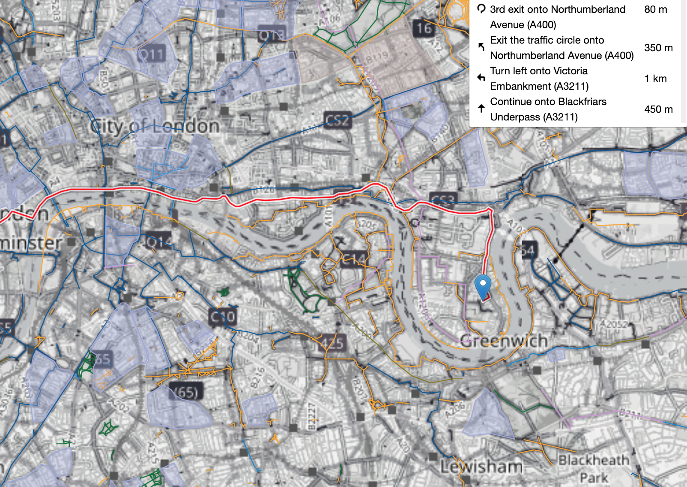

# SafeCycleLondon
A *proof of concept* web application to allow route planning, and tracking whilst using a mobile device with glonass/gps capability. 
If you plan on using something like this regularly, we need to create an indipendant server and mobile app!


## References
- https://www.google.com/maps/d/u/0/viewer?hl=en&amp;mid=1XlpvN9R-Wg7qZHyezO8y-eVlftr4e0WX&amp;ll=51.516975804561284%2C-0.21828576419061996&amp;z=10


### Empty Demo
The main page only displays the KLM overlay using open streetmaps and your location (if using a mobile device)

https://wolfiex.github.io/safecyclelondon/


## Custom start and end points with routing
As a proof of concept a routing line can be integrated. For instance using the lat and lng  we can request a route between Buckingham Palace and Greenwich


https://wolfiex.github.io/safecyclelondon/#51.5014,-0.1419#51.4934,-0.0098

Here the hash defines the start and end locations
```
<url>/#lat,lon#lat,lon
```

<span>  ....  </span></img></img>


## Saving an edited route
We can drag both the end markers (to reroute) or the routing path to introduce additional waypoints.

In doing so the URL of the file changes,by inserting more waypoints into the hash string. This means we can save the new updated url and share an edited map with friends, or reload it on the way.

https://wolfiex.github.io/safecyclelondon/#51.5014,-0.1419#51.51855097603325,-0.0868142685363016#51.46530986276388,-0.0644928664512312#51.4934,-0.0098

</img>


## Using the CylcOsm overlay
We can also combine this with the cyclosm tiles:
https://wolfiex.github.io/safecyclelondon/cyclosm.html#51.5014,-0.1419#51.4934,-0.0098
cyclosm.html

</img>

### A note on updating the Layer
As new cycle routes are added, the KML layer needs to be updated. Feel free to send push requests when this happens.


### optional (if there is funding for it)

- [ ] actual bicycle routing options and times
- [ ] fully functioning app
- [ ] route store and comments
